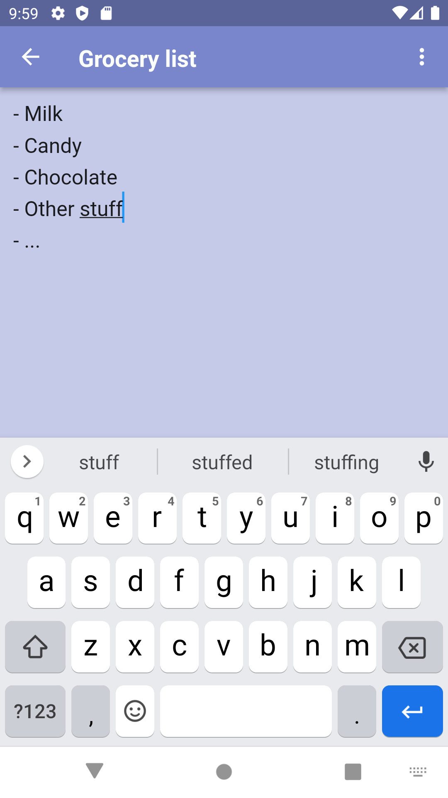

<h1 align="center">Paper</h1>
<h3 align="center">A simple app for writing notes.</h3>

   

 
**Paper** was developed for my sister as she got annoyed of getting spammed with adds using the Android app `notes`.

## Disclaimer
I just wanted to create a simple app that worked for Android. The core code is from [here](https://github.com/santhalakshminarayana/zehero-note), but needed to do some stuff to get it working for the new Android versions, as well as modified the themes quite a bit.

## TODOs
- [x] Stable version
- [ ] Bullet list (ironic)
- [ ] Markdown-esque writing notation
- [ ] Emoji support

## License
Do whatever you want with this. Just don't make note apps with adds!

## Credit
Based on the sample app by @santhalakshminarayana from [here](https://github.com/santhalakshminarayana/zehero-note).
