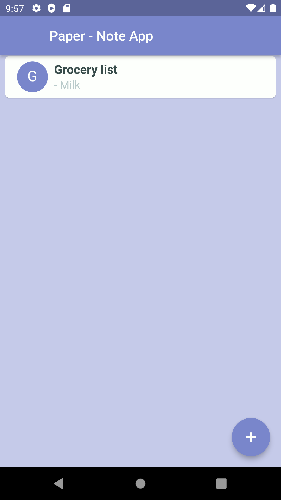

# paper

A simple app to write notes.

   

Made for my sister as she got annoyed of getting spammed with
adds using the Android app `notes`.

## License
Do whatever you want with this. Just don't make note apps with adds!

## Credit
Based on the sample app by @santhalakshminarayana from [here](https://github.com/santhalakshminarayana/zehero-note).
