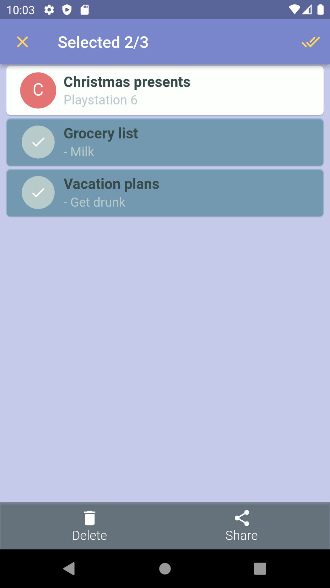
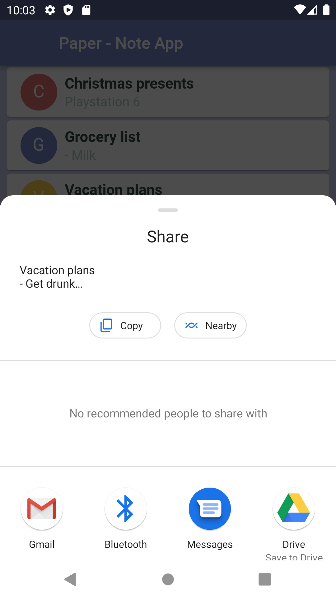

<h1 align="center">WriteStuff</h1>
<h3 align="center">A simple mobile app for writing notes.</h3>

   

 
**WriteStuff** was developed for my twin sister as of frustration over the lack of a simple ad-free note writing app.

## Usage
Simply download the APK-file from [Releases](https://github.com/andreped/WriteStuff/releases) from your Android phone. Then click on the file and it should start the installer. After installation, simply click the app icon to start the app and you are good to go!

Currently, we are unable to generate installers for iOS, as we don't have a license. Building installers for Android is free, whereas for iOS we need to pay for a license. However, if you own an apple developer's license, you can build your own iPA.

## Disclaimer
I just wanted to create a simple note writing app that worked for Android. The core code is from [here](https://github.com/santhalakshminarayana/zehero-note), but needed to do some stuff to get it working for the new Android versions. I also changed the themes/style quite a bit. More to be added in the future.

## TODOs
- [x] Stable version
- [x] Emoji support
- [X] Support for iOS
- [ ] Bullet list (ironic)
- [ ] Markdown-esque writing notation
- [ ] Ability to add notes to categories and traverse through them
- [ ] Different types of notes (grocery lists, reminders, TODO lists, ...)
- [ ] Ability to change home theme from templates (or set color for entire theme)

## License
Do whatever you want with this, just don't make note apps with ads, because thats cringe!

## Credit
Based on the sample app by @santhalakshminarayana from [here](https://github.com/santhalakshminarayana/zehero-note).
